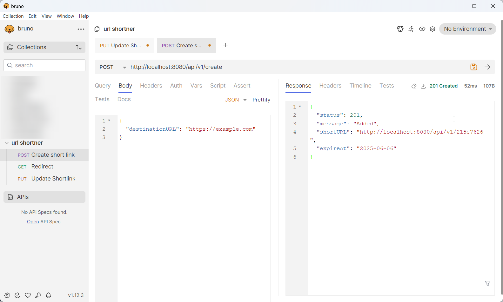

# URL Shortner

API for an URL shortner made in 2 days for Vidyayatan Technologies. This project will not be maintained anymore since the the deadline has been crossed after the last commit.

# Things accomplised (and planned for) in 2 days

- [x] Can create, update, use shortlinks
- [x] Ratelimiting
- [x] Analytics
- [ ] Docker support
- [ ] Live link

# Images

Creating a short link: 

Updating a short link: 

Updating a short link: 

# Stack Used

- Java (Language)
- SpringBoot (Backend Framework)
- JUnit, Mockito (For testing, mocking etc..)
- Bucket4j (Rate limiting)
- Postgres (Database)

